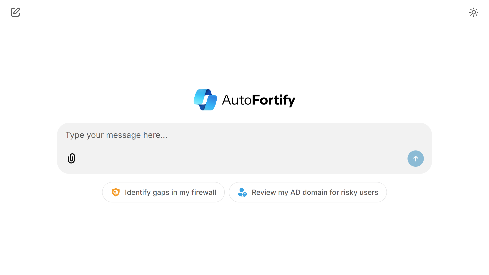
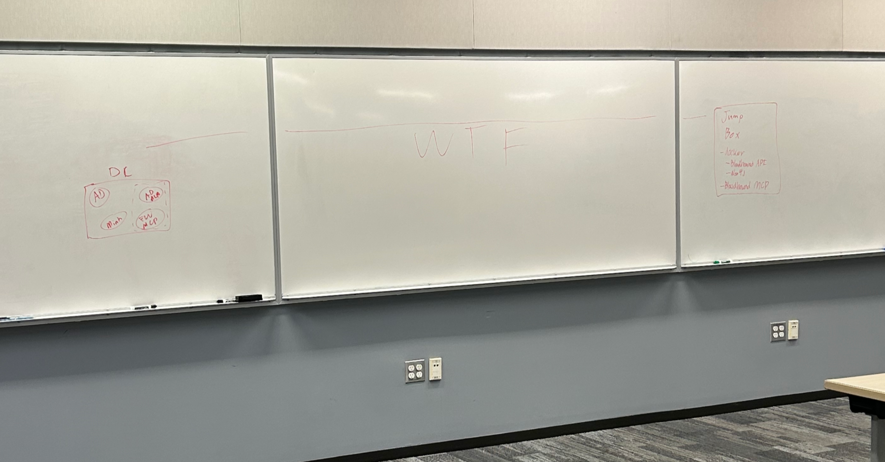

<div style="text-align:center">
  <picture align=center>
    <source media="(prefers-color-scheme: dark)" srcset="https://raw.githubusercontent.com/AutoFortify/autofortify/refs/heads/thomas-dev/agent/public/logo_dark.png" algin=center>
    
  </picture>
</div>

AutoFortify is a suite of Model Context Protocol (MCP) tools that empowers IT administrators to secure Windows devices and services using natural language.



## Features

- **Natural Language Security Management**: Interact with Windows security tools using LLMs and context
- **Real-time Chat Interface**: User-friendly web interface powered by Chainlit
- **MCP Tools**: Extensible architecture using Model Context Protocol
  - Windows Firewall
  - Active Directory (requires Windows Server AD DC)
  - [Bloodhound](https://github.com/mwnickerson/bloodhound_mcp)

## Quick Start

### Prerequisites

- Python 3.12+
- Windows 10/11/Server (for Windows Security features)
- Azure OpenAI API access
- BloodHound Community Edition (optional, for AD analysis)

### Installation

1. **Clone the repository**
   ```powershell
   git clone https://github.com/AutoFortify/autofortify.git
   cd autofortify
   ```

2. **Set up the Agent**
   ```powershell
   cd agent
   pip install -r requirements.txt
   ```

3. **Configure environment variables**

   Create `.env` with your Azure OpenAI credentials:
   ```
   AOAI_ENDPOINT_URI=https://your-openai-endpoint.cognitiveservices.azure.com/
   AOAI_API_KEY=your-api-key
   AOAI_API_VERSION=2025-03-01-preview
   MCP_SERVER_URL=http://127.0.0.1:8081/mcp
   ```

4. **Start the MCP Server**
   ```powershell
   cd ../mcp
   pip install -r requirements.txt
   python main.py
   ```

5. **Start the Agent Interface**
   ```powershell
   cd ../agent
   chainlit run app.py -w -h
   ```

## Project Structure

```
autofortify/
├── agent/                # Optional MCP client
│   ├── app.py            # Chainlit + Semantic Kernel MCP client
└── mcp/                  # MCP servers/tools
    ├── main.py           # Windows Firewall + Active Directory MCP server
    └── bloodhound/       # BloodHound MCP server

```

## Architecture

The MCP servers are built using the [FastMCP](https://github.com/jlowin/fastmcp) library. We also implement an MCP client and agent using [Semantic Kernel](https://github.com/microsoft/semantic-kernel), while [Chainlit](https://github.com/Chainlit/chainlit) provides the frontend for the agent.



## Disclaimer

> [!CAUTION]  
> This code is NOT intended for production use, and is only intended to be run as a demo in a local, virtualized environment.
